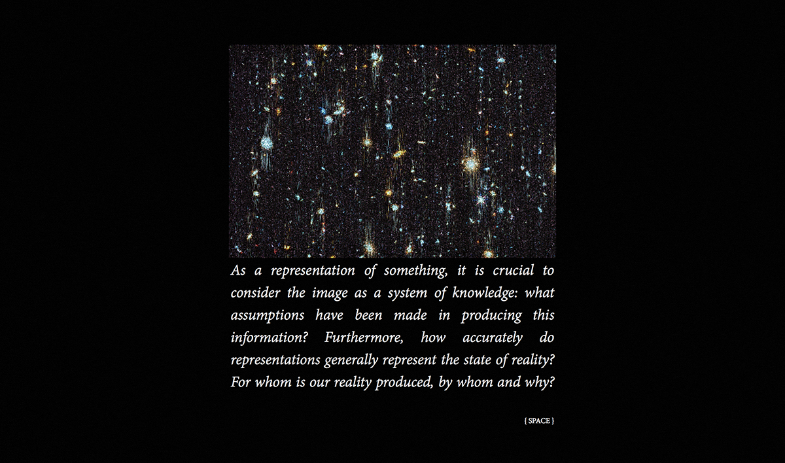
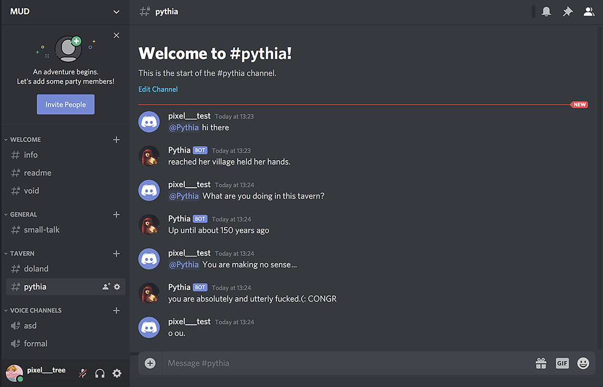
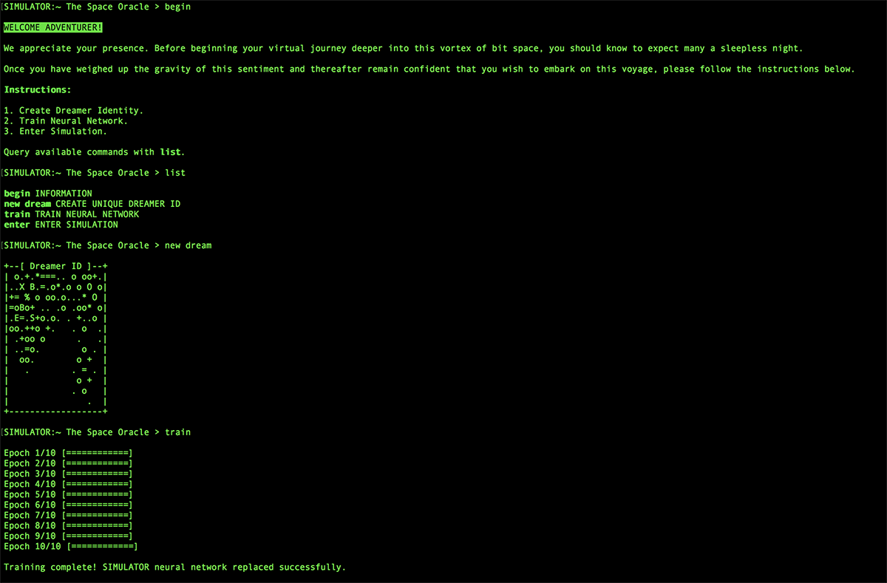

# CLOUDY LOGIC: A Visual Manifesto on Bias

Live demo: [cloudylogic.space](https://cloudylogic.space).

### CONTEXT

Cloudy Logic is a piece of philosophical writing and a multimedia artwork hosted online, made up of several narratives that broadly contemplate representations, knowledge and the nature of reality. It is inspired by an article of the same name (James, 2015), in which parallels are made between machine learning and pseudo-rational practices such as astrological forecasting: essentially, masquerading superstitions in empirical terms to make them seem more credible.

Most machine learning systems may be broken down into three main components: data representation (how information is fed into the network), objective function (a way to represent the problem) and optimisation method (the means to achieve our objective). Bias, in this context, is often associated with its negative connotations (e.g. racial bias) or in a more technical sense with underfitting (i.e. failure to capture underlying patterns in the data). The mainstream conversation rarely addresses (inductive) bias for its utility, as the double-edged sword: assumptions help learning algorithms distinguish signal from noise (further reading: priors). So how should we frame the conversation around bias in AI to constructively discuss its real-world applications and their implications?

Developed in response to conversations with various experts and nonexperts about interpretability in AI, the core idea behind the featured stories is to consider bias in the context of knowledge production, because, without specificity it is merely reduced to rhetoric—a scapegoat for a more expansive problem.


### DEVELOPMENT

"Men at some time are masters of their fates;
The fault, dear Brutus, is not in our stars,
But in ourselves, that we are underlings."

*Cassius, Julius Caesar (Shakespeare)*



My starting point was to design an experience based on the written texts. I built several prototypes utilising various platforms, for testing ways in which I could approach the construction of an interactive system. I wanted to develop something to tell the stories in an engaging and playful way—and considering the historical legacy of prediction and forecasting technologies and their connections to deities and prophecies, the idea to fit the writing within a fictional framework and to create an oracle narrator character seemed fitting.



Using custom-built bots and role-menus on Discord (messaging application), I devised an immersive and fragmented narrative, in the sense that the experience was choice-based with certain channels only visible having chosen specific options. A key part of my research was also to determine the system that would be used to develop the AI. For the chatbot, I tested a state-of-art GPT-2 language model, which showed promise after some fine-tuning; but ultimately, I decided that it would be more interesting to explore the possibilities of using the bot as an interface for accessing the narratives and, therefore, required something more easily controllable—something that would reliably provide meaningful information to the user.



As part of my research into ways in which to create an interactive narrative, I devised plans for a terminal-based multi-user dungeon. The core idea behind this was that users could connect to a shared virtual machine in the cloud and browse the media through a restricted terminal environment. Though this might have been an interesting way to approach my audience, I decided that a browser-based solution would be more appropriate for bringing the text to life.

### INSTALLATION

Developed using Python 3 and Node v13.

Project split into two folders: **server/** for Python backend and **static/** for frontend. The reason being that one of the main components is written in Python.

***Disclaimer!***

*This is one of my first projects using JS and Node so the codebase is fairly messy. Needs a rework, e.g., lazy loading, develop algos for repetitive tasks, etc... should basically be redesigned top-down.*

Clone repository:

```
git clone https://github.com/pixel-tree/cloudy-logic.git
```

Create virtualenv/pipenv install:

e.g.

```
cd cloudy-logic
virtualenv -p python3 .
source ./bin/activate
```

#### FRONTEND

Install Node dependencies:

```
cd static
npm install
```

Sequencer functions are disabled in dev mode. Use dedicated dev section in Main.js to declare scene under construction.

Start webpack-dev-server (skip to build if no further development needed):

```
npm run start
```

Access the app through ***[localhost:8080](http://localhost:8080)***. Browser refreshes when changes are made.

Once finished building frontend, bundle the app:

```
npm run build
npm run loader
```

#### DIALOGFLOW

The chatbot component should be implemented using Dialogflow v2.

It is possible to use a more custom machine learning model instead; but you will have to rewrite pythia.py. I have chosen to use Dialogflow as the chatbot is used for navigation (needs to recognise specific intents).

Create new project and agent; navigate to GCP console and create a Service Account for agent; export the keys as .json file and place in project root; create .env file, store environment variables and place in root (Dialogflow Project ID and path to .json file; see placeholders in repo) ***-- important! --*** used to prevent sharing sensitive information.

Chatbot will only work when running Flask/Python WSGI server; not with Node.

#### SERVER

Install dependencies:

```
pip install -r ../server/requirements.txt
```

For local dev server simply run:

```
python ../server/cloudy_logic.py
```

Access the app through ***[localhost:8000](http://localhost:8000)***.

#### DEPLOYMENT

Having made sure that everything works as intended, configure production server for deployment. There are a multitude of options and it may be easiest to use an app hosting service (GCP App Engine, Heroku, etc.), but I will briefly describe my workflow for documentation purposes:

Debian 10 VM with external domain;

configure ***[NGINX](http://nginx.org/en/docs/beginners_guide.html#conf_structure)*** and ***[Gunicorn](https://docs.gunicorn.org/en/stable/index.html)***;

SSL certificate using ***[Certbot](https://certbot.eff.org/lets-encrypt/ubuntubionic-nginx)***;

background service for server;

and wsgi.py entrypoint, e.g., gunicorn wsgi:app.
